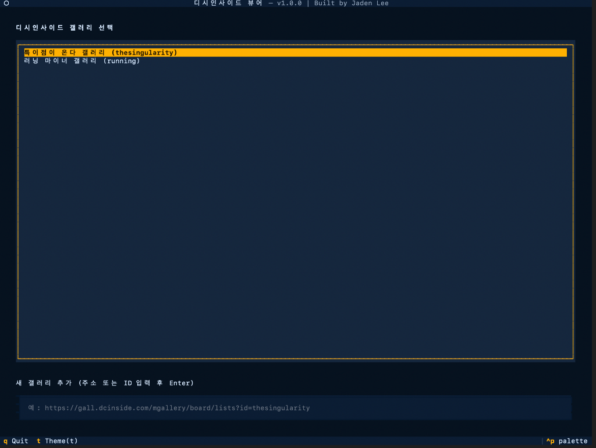
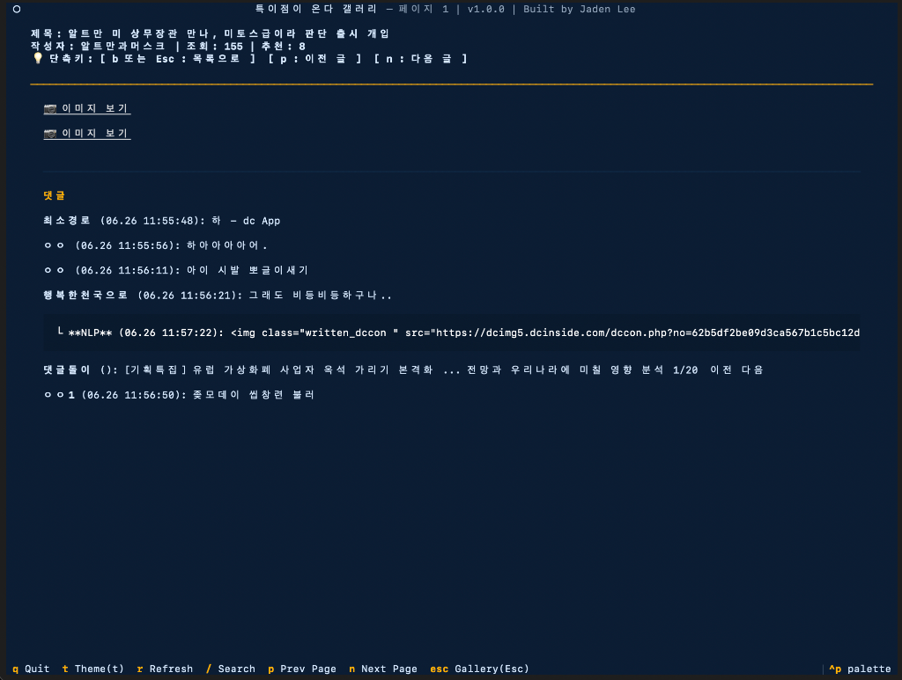
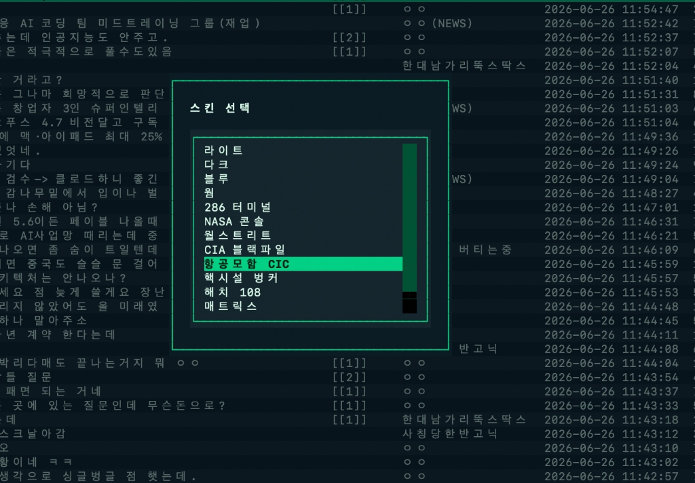

# DCInside TUI Viewer

**터미널에서 가장 빠르고 쾌적하게 즐기는 디시인사이드 뷰어**
마우스를 쓸 필요 없이 텍스트 기반 사용자 인터페이스(TUI)로 구성되어 있어, 개발자나 해커 감성을 사랑하는 분들에게 최고의 열람 경험을 제공합니다. (Built by Jaden Lee)

## 📸 스크린샷 (Screenshots)

### 1. 첫 화면: 멀티 갤러리 선택 (Gallery Selection)
자주 방문하는 갤러리를 등록하고 한눈에 관리하세요. 하단 입력창을 통해 원하는 갤러리 URL이나 ID를 입력하면 즉시 목록에 추가됩니다.


### 2. 게시물 본문 및 댓글 열람 (Post View & Comments)
복잡한 웹페이지 요소 없이, 오직 글 본문과 댓글에만 집중할 수 있는 깔끔한 뷰를 제공합니다. 단축키(`p`, `n`)를 통해 글 목록으로 나갈 필요 없이 이전/다음 글로 빠르게 넘나들 수 있습니다.


### 3. 실시간 커스텀 스킨 (Dynamic Theme Select)
앱 어디서든 `t` 단축키를 누르면 나타나는 스킨 선택 창. 스크린샷의 '항공모함 CIC' 테마를 비롯해 'NASA 콘솔', '매트릭스' 등 14종의 테마를 즉시 적용할 수 있습니다.


## 💡 주요 기능 (Features)

* ⚡ **키보드 중심의 쾌적한 탐색 (Keyboard-First Navigation)**
  * 오직 방향키와 단축키(`t`, `r`, `p`, `n`, `Esc` 등)만으로 갤러리 목록부터 게시물 본문까지 빛의 속도로 열람할 수 있습니다.
  * 게시글 본문에서 목록으로 나올 때 현재 페이지를 자동으로 새로고침하며, 읽던 글의 커서 위치를 그대로 기억하여 쾌적한 연속 열람이 가능합니다.
* 📁 **나만의 멀티 갤러리 지원 (Multi-Gallery Support)**
  * '특이점이 온다', '러닝 마이너' 등 자주 가는 갤러리 주소를 자유롭게 추가하고 저장하여 빠르게 전환할 수 있습니다.
* 🎨 **14종의 다이내믹 커스텀 스킨 (Dynamic Themes)**
  * 'NASA 콘솔', '매트릭스', 'CIA 블랙파일', '월스트리트' 등 감성 넘치는 14가지 해커 스타일 테마를 지원합니다.
  * `t` 키를 눌러 스킨을 고르면 **앱 재시작 없이 실시간으로** 색상이 변경되며, 설정이 영구 저장됩니다.
* 🖼️ **스마트 미디어 뷰어 연동 (Smart Media Viewer)**
  * 게시글 안의 이미지(`jpg`, `png`)나 비디오(`mp4`, `gif`) 링크를 클릭하면 즉시 다운로드하여 맥 OS의 기본 이미지 뷰어로 터미널 창 옆에 스마트하게 띄워줍니다. 
* 🌐 **사용자 맞춤형 브라우저 연동 (Custom Browser Selection)**
  * 사용자의 Mac에 설치된 브라우저(Chrome, Safari, Firefox, Whale 등)를 자동으로 감지합니다.
  * `w` 키를 눌러 팝업에서 원하는 브라우저를 설정하고 영구 저장할 수 있습니다.
  * 본문 열람 중 `o` 키로 원본 글을 열거나, 기타 외부 링크를 열 때 설정한 브라우저가 실행됩니다.

## 🚀 설치 및 실행 (Installation & Run)

이 프로젝트는 Python 3 환경과 `Textual` 라이브러리를 사용합니다.

```bash
# 1. 저장소 클론
git clone https://github.com/Dogdaeii/dcinside_tui.git
cd dcinside_tui

# 2. 가상환경 생성 및 의존성 설치
python3 -m venv venv
source venv/bin/activate
pip install textual requests beautifulsoup4

# 3. 앱 실행
python app.py
```

## ⌨️ 단축키 안내 (Hotkeys)

* `t` : **스킨(테마) 선택 팝업 열기** (전역)
* `w` : **브라우저 선택 팝업 열기** (전역)
* `방향키 (위/아래)` : 리스트 및 본문 스크롤
* `Enter` : 갤러리 입장 / 게시글 열기
* `Esc` : 이전 화면으로 돌아가기 (뒤로가기)
* `p` / `n` : 게시글 목록에서 이전/다음 페이지 이동, 또는 본문에서 이전글/다음글 넘기기
* `r` : 새로고침
* `/` : 제목 + 내용 게시글 검색
* `o` : 원본 글 열기 (본문 화면에서)

## 📝 최근 업데이트 내역 (Changelog)
* **v1.1.1**
  * **[버그 수정]** 댓글 내에 멘션이나 링크 등 HTML 태그(`<a href="...">`)가 포함될 경우 텍스트가 화면 밖으로 넘치거나 깨지는 현상을 파싱 로직을 개선하여 수정했습니다.
  * **[버그 수정]** Mac에서 스마트 미디어 뷰어(이미지/영상 자동 띄우기) 실행 시 '손쉬운 사용' 권한이 없어 창 우측 정렬이 실패할 경우, 권한 허용을 안내하는 알림(Warning)을 추가했습니다.
* **v1.1.0**
  * **[기능 개선]** 게시글 본문에서 목록으로 나올 때 현재 페이지를 자동으로 새로고침하며, 읽던 글의 커서 위치를 기억하도록 개선했습니다.
  * **[기능 개선]** 사용자가 선호하는 웹 브라우저를 직접 선택(`w` 키)하고 저장하여 원본 글을 열 수 있는 브라우저 설정 기능을 추가했습니다.

## 🛠️ 기술 스택 (Tech Stack)
* **Python 3**
* **Textual**: 빠르고 아름다운 TUI 프레임워크
* **BeautifulSoup4**: HTML 파싱 및 웹 크롤링
